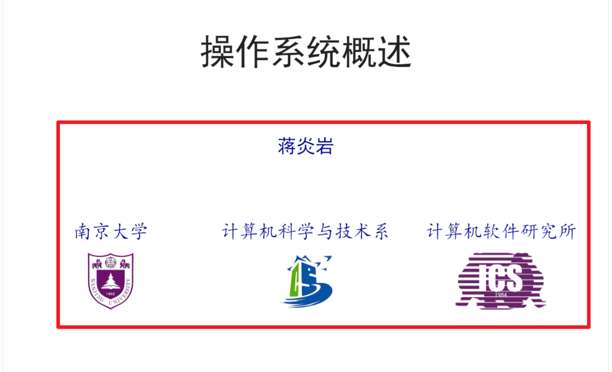

# jyyslide-md

一款通过简单的Mardown扩展语法生成具有[南大蒋炎岩老师幻灯片](http://jyywiki.cn/OS/2022/slides/1.slides#/)的形式和主题的工具，准确的说应该是一款Reveal.js的定制化前端框架。

[Background](#background) | [Install](#install) | [Usage](#usage) | [Grammer](#grammer) | [Example](#example) | [Acknowledgement](#acknowledgement) | [License](#license)

## Background

可以从奥卡姆剃刀（如无必要，勿增实体）的角度考虑我开发本项目的发心。

说起幻灯片，首先想到的是微软的PowerPoint，PPT几乎成了幻灯片的代名词。但是在使用过程中我们会发现，它提供的很多的功能，为了应用这些功能需要很高的学习成本，但大多数场景我们用不到这么多功能；而简单的Copy模板会由于不熟悉功能而发挥不出模板PPT的全部效果。能改良这样的情况嘛？
>有点像Markdown的出现对比Office Word

实际上有很多基于Web的幻灯片，我基本都[尝试](https://github.com/zweix123/CS-notes/blob/master/Missing-Semester/slide.md)了一下，但是并没有完全满足我的要求的项目，于是考虑自己开发。

[南京大学蒋炎岩老师](https://ics.nju.edu.cn/~jyy)开源了他的[操作系统课程](https://space.bilibili.com/202224425)，相信上过他的课的同学除了会被他深入浅出的授课方式折服，也一定对他的幻灯片感兴趣。他的幻灯片基于[Reveal.js](https://revealjs.com/)这个Web幻灯片框架，但不清楚他具体是如何制作的，在经过他的同意下，我制作了这个将Markdown方言转换成和他一个形式和主题的幻灯片的工具。

对于Markdown扩展语法的设计尽可能简单，有些功能不是不能提供，但是提供会导致语法没有性价比的扩张，所以舍弃。让设计尽可能足够且简约。

## Install

本项目使用Python开发，模块管理使用Poetry，请确保您的机器上有版本足够的Python并安装有第三方模块Poetry，同时也得益于Python，本项目应该可以运行于任何系统。
>关于Poetry参考我的[笔记](https://github.com/zweix123/CS-notes/blob/master/Programing-Language/Python/poetry.md)，当然下面会提供足够的用法。

1. 克隆项目到本地并进入：
    ```bash
    git clone git@github.com:zweix123/jyyslide-md.git
    cd jyyslide-md
    ```
2. 利用Poetry下载第三方模块
    ```bash
    python3 -m poetry install
    # 或者 poetry install
    ```


## Usage

+ 使用Peotry管理的Python有两种运行方式
  1. 进入虚拟环境：
      ```bash
      python3 -m poetry shell
      # 或者 poetry shell
      ```
      之后就可以正常的运行Python代码了
  2. 使用前缀：在运行Python代码的命令前添加`python3 -m poetry run`（或者`poetry run`）

命令格式如下
```bash
python main.py [Markdown文件]
```
在Markdown文件同级目录会出现一个`dist`文件夹，其下有一个index.html文件和一个static文件夹，前者即为生成的“Web幻灯片，static即为其相关静态文件。网页的title和Markdown文件同名、icon即为`static/img/favicon.png`，可通过替换这个文件修改icon。


### Grammer

+ 水平幻灯片使用`\n---\n`（三个）分割
+ 垂直幻灯片使用`\n----\n`（四个）分割
+ 渐变垂直幻灯片使用`\n++++\n`(四个)分割
+ 在同一张幻灯片中依次出现的部分使用`\n--\n`(两个)分割
  + 具体分割方式是从分割符到下一个分隔符或者本张幻灯片末尾的位置
  + 更多样式见[reveal.js官网对Fragments的解释](https://revealjs.com/fragments/)
+ 作者信息使用`\n+++++\n`(五个)分割，使用Json格式  
  这里指的是这部分  
  
  因为这部分是多个文字、图片、链接为一体，如果使用扩展Markdown语法的设计会让语法很凌乱，实际上这样的HTML只在第一页出现，即使不适用该语法也能实现首页效果，所以把这部分分离出来。  
  比如蒋老师的首页的Json可以使用下面（test下的jyy就是该幻灯片）
  ```
  {
      "author": {
          "name": "蒋炎岩",
          "url": "https://ics.nju.edu.cn/~jyy/"
      },
      "departments": [
          {
              "name": "  南京大学  ",
              "url": "https://www.nju.edu.cn/main.htm",
              "img_url": "./img/nju-logo.jpg"
          },
          {
              "name": "计算机科学与技术系",
              "url": "https://cs.nju.edu.cn/main.htm",
              "img_url": "./img/njucs-logo.jpg"
          },
          {
              "name": "计算机软件研究所",
              "url": "https://www.nju.edu.cn/main.htm",
              "img_url": "./img/ics-logo.png"
          }
      ]
  }
  ```

---

+ 对Markdown原生语法适配情况：
  >这里使用的Markdown语法使用的是严格语法。
    + 文字格式：
        + 通过Markdown原生语法支持加粗、斜体
        + 通过插入html支持删除线（`del`）、高亮、标红（`red`）
    + 支持注释
    + 支持列表
    + 支持代码和代码高亮
        >reveal-md和slidev支持的代码特定行高亮和有序高亮不支持
    + 支持引用（链接和图片）
    + 支持数学公式
    + 支持表格（但蒋老师提供的CSS没有对表格的美化，所以建议不使用）
    + 支持图片，推荐以插入HTML格式的方式使用
      ```html
      
      ```
      这里的src支持URL，相对地址和绝对地址，程序会将其down或者copy到dist下的img中
      >这里使用的爬虫是非常简单的爬虫，建议自己下载到本地使用。
      
      图片默认居中，像右对齐使用下面的格式
      ```html
      
      ```
      其他格式调整SFTW

## Example

+ `test/jyy/操作系统概述.md`即为蒋老师2022年的第一节课
  ```bash
  python main.py test\jyy\操作系统概述.md
  ```
  打开`test\jyy\dist\index.html`即可查看

+ `test/Intro/slide.md`即为本项目介绍的幻灯片
  ```bash
  python main.py test\Intro\slide.md
  ```
  打开`test\study\dist\index.html`即可查看

## Acknowledgement
+ 感谢[南京大学蒋炎岩老师](https://ics.nju.edu.cn/~jyy/)录制了如此优质的[操作系统课程](https://jyywiki.cn/)
+ 感谢[顾若水](https://github.com/ruoshui255)大佬提供的[“肩膀”](./src/backup/rouv/ruoshui255.md.py)

## License

[MIT](LICENSE) © Richard Littauer